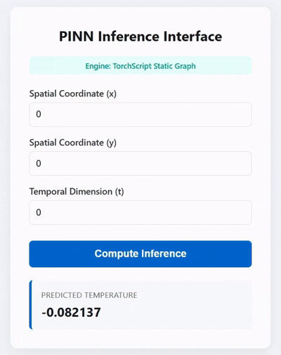

# PINN-Ops: Low-Latency SciML Inference Engine with GitOps Continuous Validation



A production inference service for a **weak-form (variational) Physics-Informed Neural
Network** — a spatiotemporal PDE surrogate trained using a FastVPINN-style tensor-
contraction formulation, served through a TorchScript-compiled, multi-worker FastAPI
stack with CI-gated performance regression testing.

This isn't just a model wrapped in an API — the underlying network is trained via the
weak (variational) form of the 2D heat equation, using precomputed Legendre-polynomial
test functions and Gauss-Legendre quadrature rather than raw pointwise collocation, so
the model itself embeds a nontrivial piece of numerical PDE methodology, not just a
generic regression fit. Full derivation and the debugging process behind it: see
[`FastVPINN_Project_Reference.md`](FastVPINN_Project_Reference.md).

---

## Project Status

Deployed and benchmarked. CI pipeline active on `main`.

---

## Why this exists

Classical numerical PDE solvers (finite element, finite difference) are accurate but
slow to query at inference time — every new coordinate requires re-solving or
interpolating from a stored grid. A trained neural surrogate, once fit to the governing
PDE, collapses that cost to a single forward pass. This project builds and ships one
end-to-end: from the PDE formulation, through training-time architectural choices
(weak-form loss, quadrature-based integration), to a hardened, load-tested production
API.

---

## Architecture

```
[ Spatial/Temporal Inputs ] -> (x, y, t)
            |
            v
+-----------------+
|  Frontend (UI)  |  <- Served via FastAPI StaticFiles
+-----------------+
            |
            v  (Async JSON)
+------------------------------------------------------------+
| Docker Container  (non-root: appuser / Alpine Linux)       |
|                                                            |
|  [ Port 8000 ]                                             |
|       |                                                    |
|       v                                                    |
|  Master Uvicorn Process (load balancer)                    |
|    |          |          |          |                      |
|    v          v          v          v                      |
|  Worker #1  Worker #2  Worker #3  Worker #4                |
|    |          |          |          |                      |
|    +----------+----+-----+----------+                      |
|                    |                                       |
|                    v                                       |
|         Pydantic Input Validation                          |
|                    |                                       |
|                    v                                       |
|         JIT TorchScript Engine (compiled graph)            |
|                    |                                       |
|                    v                                       |
|            [ Tensor Forward Pass ]                         |
+------------------------------------------------------------+
                    |
                    v
        {"predicted_temperature": float}
```

### 1. The model: weak-form PINN, not a generic regressor

The served model was trained by minimizing the **variational (weak) form** of the 2D
heat equation — integrating the PDE residual against precomputed Legendre-difference
test functions over a meshed domain, via Gauss-Legendre quadrature, rather than
enforcing the PDE pointwise via second-order automatic differentiation. This trades a
strong-form PINN's expensive Hessian computation for a single first-order pass plus a
batched tensor contraction (`einsum`) against precomputed constants — cheaper to train,
and in this project's testing, meaningfully more accurate at matched training budgets.
See the reference doc for the full derivation, the test-function construction that
makes this stable, and an honest account of what was and wasn't rigorously isolated in
that comparison.

### 2. Compiled inference core

At startup, the trained model is loaded and trace-compiled via TorchScript JIT
(`torch.jit.trace` + `torch.jit.freeze`) against a dummy coordinate tensor. This
produces a static, serialized computation graph: once compiled, the forward pass no
longer re-interprets Python-level model code on every call, reducing per-request
overhead compared to eager-mode execution. (Note: this reduces *Python graph
re-interpretation* overhead specifically — it does not remove the interpreter/GIL from
the request-handling process itself, since the traced module is still invoked from
within Python/Uvicorn.)

### 3. Async serving layer

FastAPI on Uvicorn's ASGI server, running four parallel worker processes to use
available CPU cores concurrently. Incoming JSON payloads `(x, y, t)` are validated by a
strict Pydantic model (`ge=0.0, le=1.0` on every coordinate) before reaching the
inference engine — the model has no accuracy guarantees outside its trained domain, so
this is a real correctness boundary, not just input hygiene.

### 4. Hardened container

Runs on an Alpine Linux base image. A dedicated `appuser` group/user is created at build
time, with root dropped entirely before the Uvicorn runtime starts and build tooling
stripped from the final image — standard container-hardening practice, reducing the
attack surface available to any request-level exploit.

### 5. GitOps continuous validation

Performance is a first-class regression test, not a manual afterthought. Every push to
`main` triggers a GitHub Actions run that:

1. Builds a clean container image from scratch
2. Launches the container and waits for JIT warmup across all workers
3. Runs `load_server.py` — a multi-threaded stress test tracking full latency
   distributions, not just averages
4. Compares p95/p99 tail latency and throughput against fixed quality gates
5. Fails the build and blocks the merge if any gate is breached

Config lives in `.github/workflows/ci.yml`.

---

## Performance Benchmarks

*(Figures below are from the last verified run committed to this repo — update this
table when you have new load-test results.)*

| Metric | Result | Gate | Status |
| :--- | :---: | :---: | :---: |
| Sustained Throughput | 616.52 req/s | > 100 req/s | ✅ Passed |
| p95 Tail Latency | 21.05 ms | < 100 ms | ✅ Passed |
| p99 Tail Latency | 24.49 ms | < 150 ms | ✅ Passed |
| Transaction Success Rate | 100.0% | 100.0% | ✅ Passed |

These are end-to-end HTTP round-trip numbers (network + validation + inference), not
isolated model forward-pass time — worth keeping that distinction in mind if you ever
quote a "per-inference" latency figure separately.

---

## Project Structure

```
├── .github/
│   └── workflows/
│       └── ci.yml              # CI performance validation pipeline
├── frontend/
│   ├── index.html              # UI layout
│   ├── app.js                  # Single-point prediction: fetch + render logic
│   ├── plotter.js               # Batch prediction + Chart.js trend visualization
│   ├── style.css               # Styling
│   └── Demo.gif                 # Interface demo
├── server.py                   # FastAPI app — validation, JIT inference, static serving
├── load_server.py              # Parallel stress test and tail latency reporter
├── Dockerfile                  # Non-root Alpine multi-worker image
├── model_fastvpinn.pt          # Serialized model weights (see Model Weights below)
├── FastVPINN_Project_Reference.md   # Full derivation + debugging journal for the model
└── requirements.txt              # Version-locked Python dependencies
```

---

## Prerequisites

- Docker (tested on 24.x)
- Python 3.12+ (only needed to run `load_server.py` outside Docker)
- `model_fastvpinn.pt` — serialized weights must be present in the repo root before
  building. See [Model Weights](#model-weights) below.

---

## Quickstart

**1. Build the image**
```bash
docker build -t pinn-inference:latest .
```

**2. Run the container**
```bash
docker run -d -p 8000:8000 --name pinn-container pinn-inference:latest
```

**3. Open the UI**
```
http://localhost:8000
```

**4. Run the load test manually**
```bash
python load_server.py
```

Fires the same stress test the CI pipeline runs and prints a full latency distribution
report.

---

## Model Weights

`model_fastvpinn.pt` holds the trained weights for a PINN surrogate predicting
spatiotemporal temperature fields `u(x, y, t)` over the unit domain `[0,1]³`, trained
via the weak-form FastVPINN methodology described in
[`FastVPINN_Project_Reference.md`](FastVPINN_Project_Reference.md). The model was
trained separately and committed as a binary artifact; it's loaded as a plain
`state_dict` and JIT-compiled at container startup (see `server.py`'s `lifespan`
handler).

**If you retrain or swap in a different model:** make sure the saved artifact matches
what `server.py` expects — a `state_dict` from `torch.save(model.state_dict(), path)`,
not a full pickled model or a pre-traced `torch.jit` module (those load differently and
will fail against the current loading code).

---

## CI Pipeline Details

The workflow in `.github/workflows/ci.yml` runs on every push to `main`:

```yaml
# Simplified outline — see ci.yml for full config
- Build Docker image
- Start container (docker run -d ...)
- Sleep N seconds   # absorb JIT warmup across all 4 workers
- Run load_server.py
- Assert: throughput > 100 req/s
- Assert: p95 < 100ms, p99 < 150ms
- Assert: success rate == 100%
```

Threshold constants live at the top of `load_server.py`; the trigger branch is set in
`ci.yml`'s `on: push: branches:` field.

---

## Further reading

For the actual numerical methods behind the served model — the weak-form derivation,
the quadrature and test-function choices, the loss-weighting pitfalls hit along the
way, and an honest account of what was and wasn't rigorously verified — see
[`FastVPINN_Project_Reference.md`](FastVPINN_Project_Reference.md).
